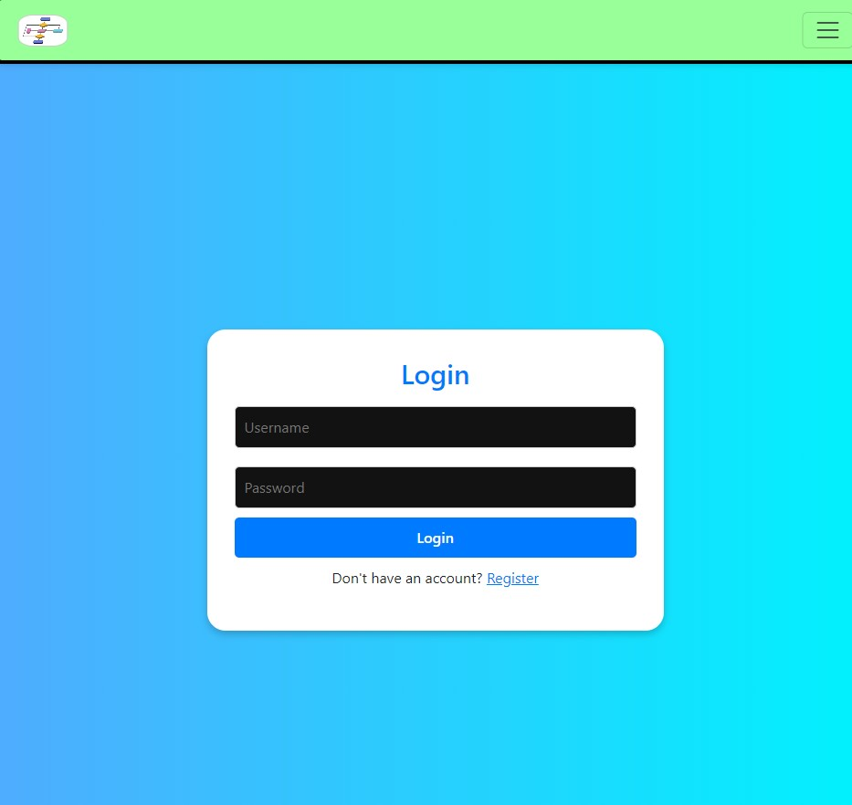
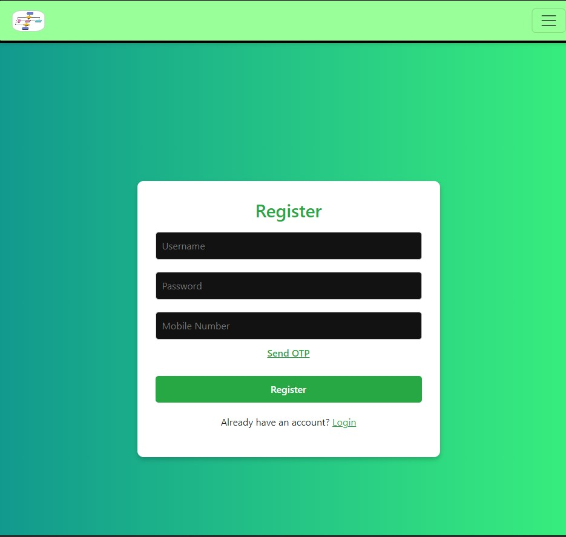
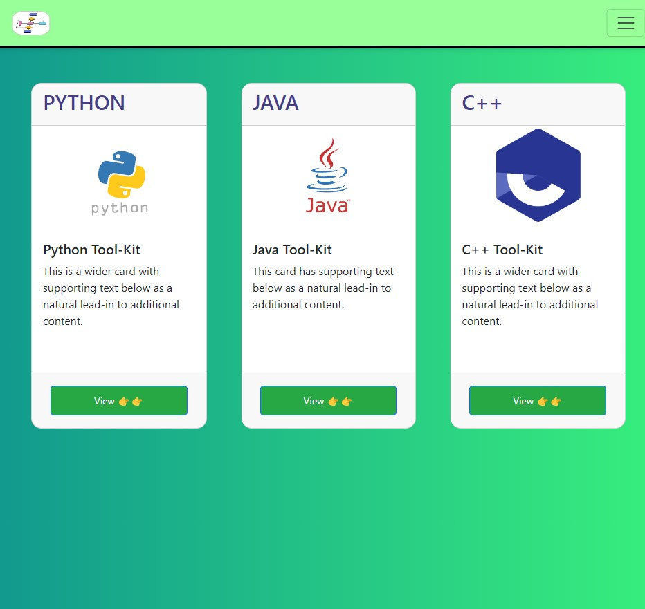
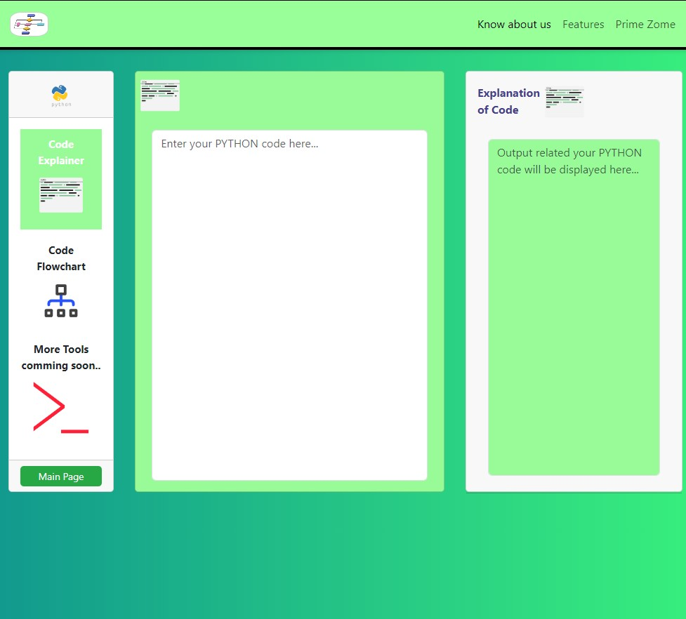
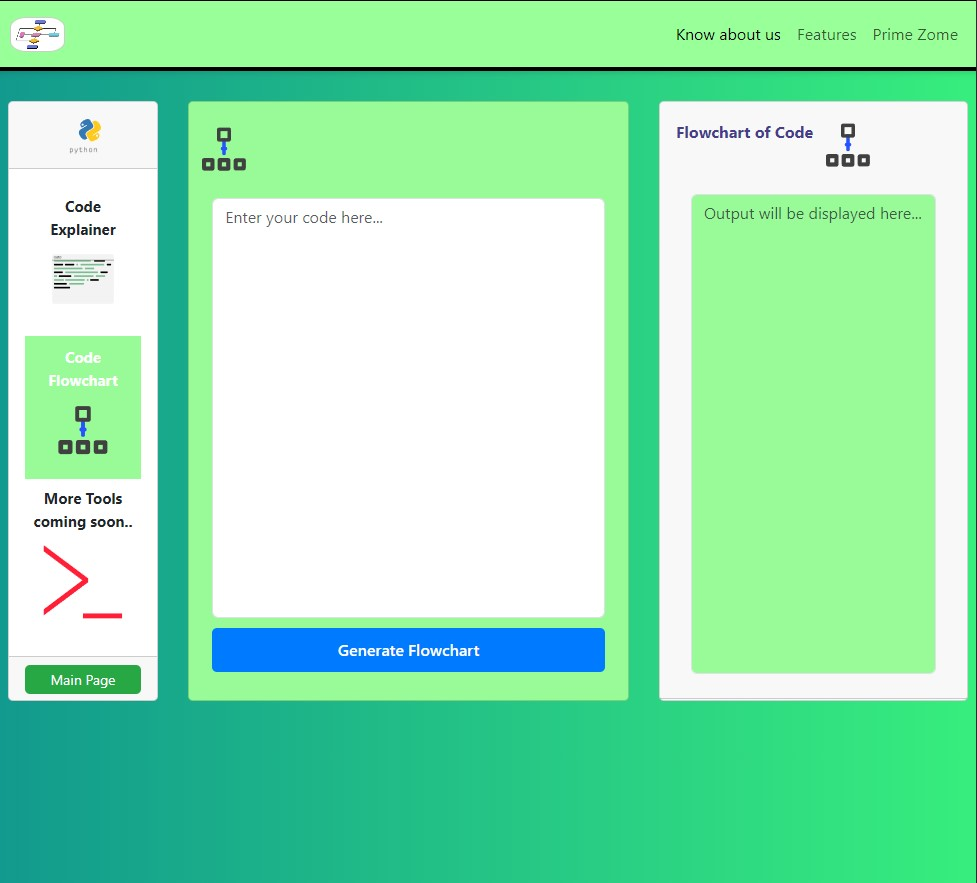

# Coding ToolKit
#Tools:-

1 - Code Flowchart

2 - Explanation Tool

This is a full-stack web application built using React (Vite) on the frontend and Spring Boot on the backend. It allows users to input code (Java, C, Python), get line-by-line explanations, and generate flowcharts using Mermaid.js.

## 🧩 Features
- Real-time code explanation for Java and C
- Flowchart generator using Mermaid.js
- Clean dual-view layout (Code + Output)
- Built with Spring Boot + React + Vite

## 🛠️ Tech Stack
- Frontend: React, Vite, Bootstrap, Lottie
- Backend: Spring Boot, Java
- Visualization: Mermaid.js

## Project Screenshots

### Dashboard


### Login


### Register


### Home Page


### Tools
### 1 - Code Explainer


### 2 - Code Flowchart



## 🚀 Getting Started

### Frontend
```bash
cd frontend
npm install
npm run dev
it


